= Auditability
:Notice: (c) 2015 Eurocommercial Properties Ltd.  Licensed under the Apache License, Version 2.0 (the "License"); you may not use this file except in compliance with the License. You may obtain a copy of the License at. http://www.apache.org/licenses/LICENSE-2.0 . Unless required by applicable law or agreed to in writing, software distributed under the License is distributed on an "AS IS" BASIS, WITHOUT WARRANTIES OR  CONDITIONS OF ANY KIND, either express or implied. See the License for the specific language governing permissions and limitations under the License.
:toc: right
:numbered:
:_basedir: ./

## Introduction

Estatio is designed to be auditable both from a business- and technical- perspective.

* from a business perspective, all invoices generated can be traced back to their underlying source, for example a `LeaseTermForIndexableRent`.  If there is change in that source data, then invoices can be regenerated either for the current period or retrospectively for a period in the past.

* from a technical perspective, all changes made to the system are tracked by end-user.

Moreover Estatio is built on open source technologies, and is itself open source, and has a comprehensive test suite.  This means that the algorithms encoded within the application are fully accessible to be inspected and verified.

## Business-level Auditability

Within the business, we need to distinguish between:

. what should be invoiced, as per the agreed contract with the tenant
. what has been invoiced for the current and previous periods
. what has been paid by the tenant.

At its heart Estatio is an invoice calculation engine, and thus is responsible for the first two points: what should be invoiced, and what has been invoiced.  The responsibility for keeping track of what the tenant has paid meanwhile is that of the General Ledger system; Estatio plays no part in sending out direct debit requests and so forth.

What this means is that, so far as lease contracts and invoices are concerned, Estatio is considered to be the "source of truth" .  In particular, if the business user asks to recalculate invoices are previous periods in a "retro run" (for example because of changes to indexation), then Estatio never asks the General Ledger for any information.

### Traceability from Contract Data to Invoice Data

The key concepts in Estatio are `Lease`, `LeaseItem`, `LeaseTerm`, `InvoiceItem` and `Invoice`:

* a `Lease` is an agreement for a tenant to pay while occupying a unit, normally agreed to last many years;
* a `LeaseItem` is a component part of the `Lease`, for example for the tenant to pay rent, or service charges.  There are (currently) 8 different types of `LeaseItem`;
* a `LeaseTerm` are created as required as the `Lease` continues over time, one per `LeaseItem` of the `Lease`, typically one per year.  It is the `LeaseTerm` that acts as the source of the invoices;
* an `InvoiceItem` is the amount of money calculated as due to be paid by the tenant for a particular `LeaseTerm` pro-rata for a particular period;
* an `Invoice` aggregates all ``InvoiceItem``s for a given `Lease` and period.

`Lease`, `LeaseItem` and `LeaseTerm` are the contract data.  The `Lease` relates back to a `Party` as the tenant, and also captures the payment method.  The `Lease` also specifies the `Unit` (fixed asset) that the tenant occupies.

When an `InvoiceItem` is generated the system looks for an `Invoice` to attach it to (for that period).  If none exists, one is created on the fly; subsequent ``InvoiceItem``s from other ``LeaseTerm``s are attached to that same invoice.

The figure below shows these concepts, where "now" is somewhere in Q3, the `LeaseTerm` exists for the year, and an ``InvoiceItem``s has been generated for the Q3 period:

.LeaseTerms generate InvoiceItems
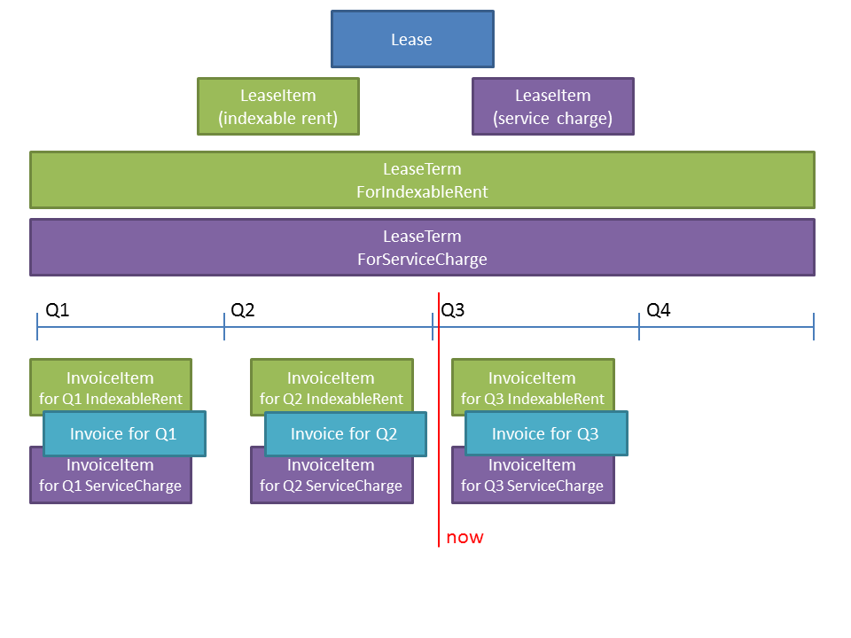

The Estatio user interface also shows the linkage between these concepts; the diagram below shows a `LeaseTerm` object and corresponding ``InvoiceItem``s:

.Estatio user interface showing a LeaseTerm with corresponding InvoiceItems
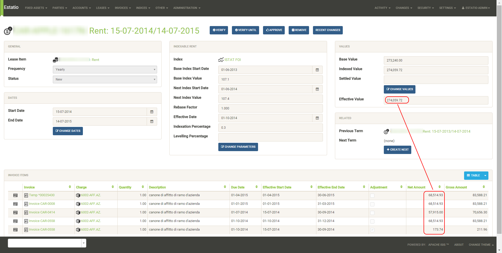

### Idempotency and Immutability of an Invoice

Once an `Invoice` has been finalised, eg an invoice number has been assigned, then it and all of its ``InvoiceItem``s are immutable; they can no longer change.  The system also ensures that none of the source contract data (the ``LeaseTerm``s) can be deleted.

A "retro-run" allows the business user to recalculate the amounts to be paid for previous periods.  And of course if there have been no changes in any of the contract data, then no new ``InvoiceItem``s are generated; nothing additional needs to be paid.  `Invoice` generation is therefore an idempotent operation.

However, if there has been an after-the-fact change in some contract data, then the `InvoiceItem` amounts previously generated will be incorrect with respect to the updated contract data.  One particular case where this happens routinely is with indexable rents.  Here the updated indexes may only be made available _after_ the period to which they apply.  So, when those updated indexes are eventually uploaded, a retro-run will end up creating additional ``InvoiceItem``s, being the delta of what was invoiced versus what is now determined to be owed.

The figure below shows this:

.Retro-run creates new InvoiceItems if existing is approved
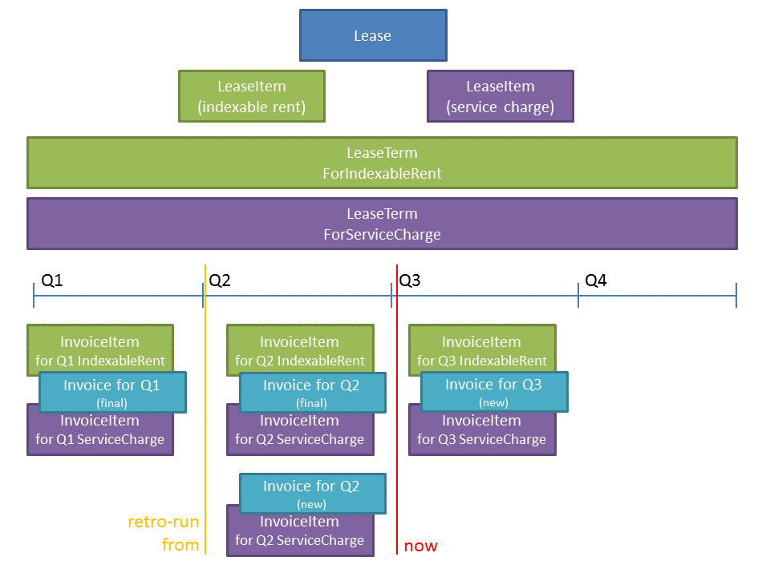

For Q2, because the `Invoice` (and its items) is approved and therefore immutable, we see a new `InvoiceItem` (and containing `Invoice`) is created for the delta.  For Q3, because the `Invoice` is not yet approved, the system simply updates the existing `InvoiceItem`.

The only things that trigger an invoice to be paid are:

- change a contract
- change in indexation (after the fact)
- "time passes", ie the next period becomes due

What DOESN'T trigger an invoice generation is payment

### Idempotency of interface to General Ledger

Estatio sends invoices to be paid to the General Ledger system.  This is currently implemented as a number of remote database procedure calls (though the implementation is scheduled to change during 2015).

Estatio assigns each invoice a collection number (this happens to be sequential upon the property, eg "XXX-001", "XXX-002", but any unique identifier would have sufficed).  The important point here is that it is safe to submit the same invoice to the General Ledger system more than once, because Estatio will always ensure that the collection number assigns is unchanging.

If an invoice is received by the General Ledger system from Estatio and has not previously been collected, then the GL system can do its payment collection processing (send out direct debit files etc).  But the GL system can also exploit the fact that the collection number is unchanging; if an invoice is received that has already been sent, then the GL system can either ignore the invoice or it could send out a new payment demand, according to where in the payment processing it is.

In any case, whatever amount is collected from the tenant in any given quarter, the GL system keeps track of moneys paid and received, completely independently from the calculations of Estatio.

Estatio went live on the 1st April 2014.  Dummy ("stub") invoices for all of 2013 were created in the General Ledger system) so that retro-runs could safely be performed for any date after 1 Jan 2013.  If in the future it turns out that there is a requirement to perform a retro-run prior to this date, then additional stub invoices will need to be created in the GL system.

## System-level Auditability

From a system perspective, auditability is one of a number of inter-related security concerns, including:

* authentication ("who are you?")
* authorization ("what can you do?")
* auditing ("what did you do?")

To address each of these in turn.

### Authentication

Estatio is deployed on an internal network (*not* on the internet), and so the company's existing user directory (through the LDAP protocol) is used for user credentials (just user and password).

Estatio leverages http://isis.apache.org[Apache Isis]' http://github.com/isisaddons/isis-module-security[Security module], which maps each LDAP account to a corresponding Estatio account (a so-called "delegated" account).

### Authorization

Each Estatio account in turn maps to roles.  There are currently just two roles: _estatio_admin_, and _estatio_user_.  The admin role is for system administration; all business users are mapped to the _estatio_user_ role.

What this means is we do not distinguish between job roles within the business; there is no complex approval workflow for example.  Instead, we trust the users by granting them access to all (business functionality).

### Audit Log

On the other hand we also audit every operation performed by every user:

* each business action (command in the terminology of the system) is captured; eg user X updated the renewal date of lease Y"
* all objects changed by a business action/command are associated with audited.

That is, the auditing captures both the cause of the change to the system and the corresponding effect of that change.

Also, Estatio's idempotent design (discussed above) means that the system is to some extent "self-healing"; if a mistake is made then a subsequent retro-run can correct the error.

The diagrams below show how this is exposed in the user interface to an Estatio administrator (not to regular users).  For any given object the administrator can request to view recent changes:

.Estatio user interface showing the "Recent Changes" action for an entity
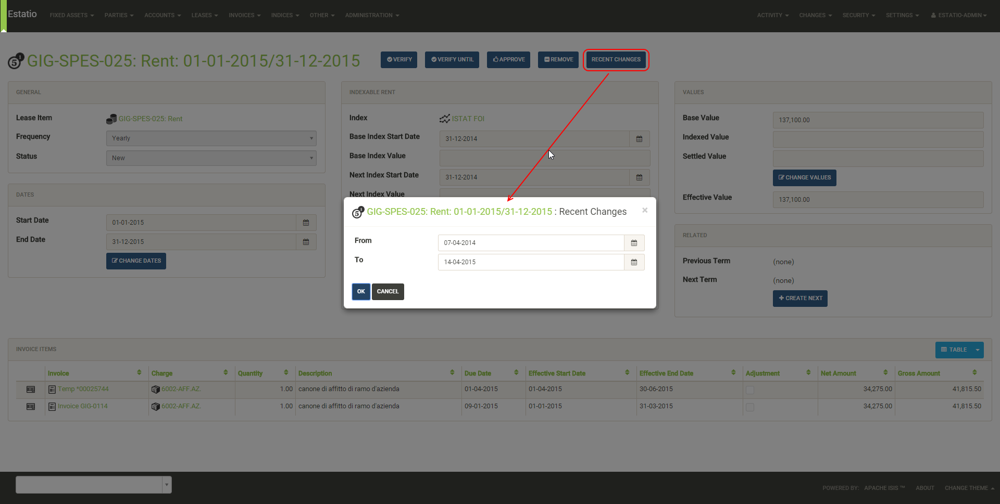

This then returns a list of changes; note how each command (cause) is followed by audit entries (effect):

.Estatio user interface showing the recent changes (commands and audit records) for an entity
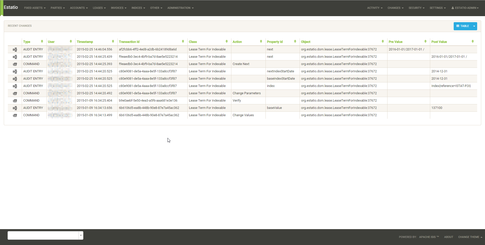

### Other security concerns

Other security concerns include:

* non-repudiation ("you can't deny you did it")
* confidentality ("the data has not been read by an unauthorized party")
* integrity ("the data hasn't been tampered with by an unauthorized party")

To some extent these topics are out of scope for this document, however we can note that Estatio is deployed over `https`, which to a large extent addresses confidentiality and integrity concerns for messages.

The audit log (which is not editable through the application) provides some guarantee of non-repudation.

Ensuring data is not tampered with once in the database, and that the system is only accessible via https and not through any backdoor etc, is not in scope of this document, straying more into sysadmin territory.

### Multi-Tenancy (work in progress)

Estatio has recently been refactored to exploit the multi-tenancy ("app tenancy") capabilities of the Apache Isis http://github.com/isisaddons/isis-module-security[Security module].  Different entities in the system (`Lease`, `LeaseTerm`, `Invoice`, `Party`, `Property` and so on) can be associated either globally, or with a given country, or a particular property within a country.

Similarly, each user can be associated at these different levels (eg a global user, or an Italian user).  A user can therefore view and edit data for their app tenancy, and can view data "above" them, but cannot access data of a peer app tenancy.  In other words, an Italian user can work on Italian data and use global reference data (eg `Party` or `Brand`), but could not access French or Swedish data.

This functionality is enforced by the underlying http://isis.apache.org[Apache Isis] framework.

## Other Concerns (Technology Risk)

Estatio is a bespoke custom application, which could be considered as a potential technology risk.

However, it should be noted that Estatio is implemented on top of http://isis.apache.org[Apache Isis] open source framework, a small but healthy community whose governance is mandated by the well respected http://www.apache.org[Apache Software Foundation].  It is licensed under the business-friendly Apache v2 Software License.

Estatio itself is open source, hosted on http://github.com/estatio/estatio[github], and is also licensed under Apache v2 Software License.

Also, Estatio has a comprehensive test suite, as does Apache Isis.  Leveraging the Isis framework in particular means that the amount of code to maintain is kept to an absolute minimum (in essence: just the business logic).

## Suggested Tests/Checks for External Auditors

Any organization deploying Estatio may wish or require that the system is checked by external auditors.  The following are ideas for tests/checks that an external auditor may wish to use to help verify the system's suitability.

...

### Typical Lifecycle of a Lease

Use the system to create a `Lease` and generate ``Invoice``s from it over a period of time.  Ideally this should include a retro-run to demonstrate the idempotency characteristic of the system.

#### Create a Lease

* choose an existing property (any will do)

* choose an existing party to act as the tenant with valid bank details (any will do); identify the party to act as the landlord (usually the operating company)

* create a Lease for the tenant and landlord
+
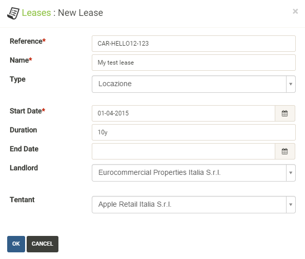

* create an Occupancy for the Lease, eg starting Q2 (1-Apr)
+
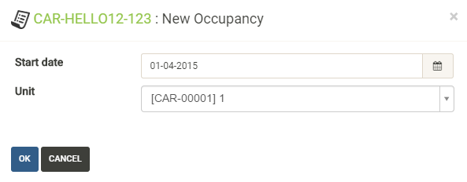

* create a new item, eg (indexable) rent
+
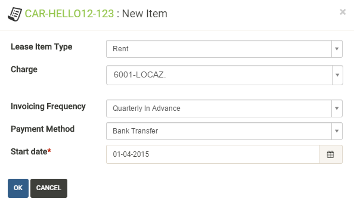

* create a new term for the first year, eg starting Q2 (1-Apr)
+
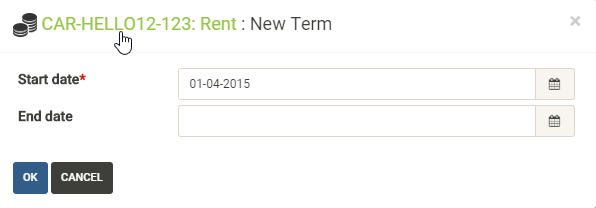

* change the parameters on the term, specifying the index to use, with an effective date set to beginning of Q3 (1-Jul)
+
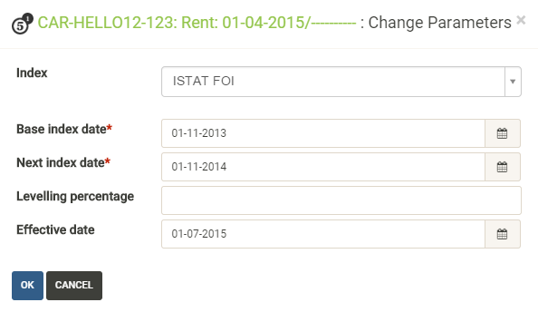

#### Normal Run and Retro Run

* change the (base) value of the term
+
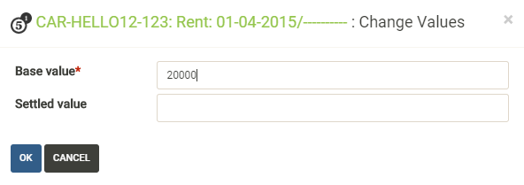

* on the lease, perform a (normal) calculate, eg for just Q2 (1-Apr to 1-Jul)
+
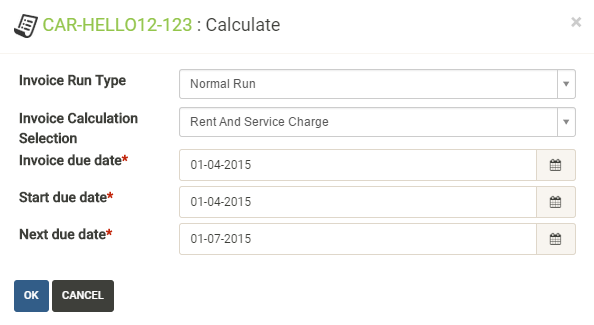

* on the generated invoice run, all the "temporary" draft (status=new) invoices are listed for the period over which the calculation was performed

* approve all invoices; the invoice is shown for the lease, with a single invoice item (for Q2)
+
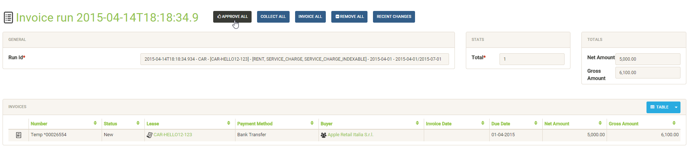

* on the lease, perform a retro run for the period for Q2 and Q3
+
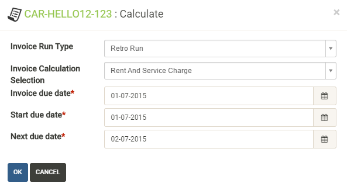

* a new "temporary" draft (new) invoice is created, with two invoice items; one for Q3 and a delta for Q2.
+
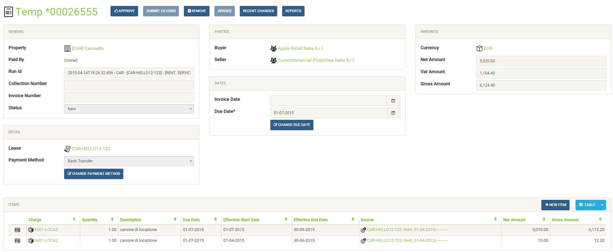

#### Pro Rata Reconciliation after Lease Termination

Normally leases are set to terminate in the future.  However, if a `Lease` terminated in the past but this was not recorded, then Estatio would have created invoices when in fact none was actually due.

* Terminate the lease in the past
+
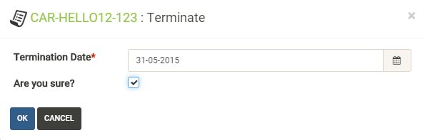

* Recalculate the lease's invoices using a retro run
+

* The approved "temporary" draft (new) invoice should have invoice items that credit the tenant.
+
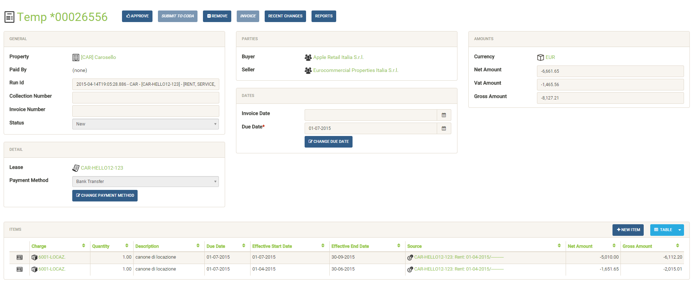

End users may also have their own user guides/cheatsheets that can be used to crib from.

### Command/Auditing Log

As discussed in <<Audit Log>>, every action performed by an end user is persisted as a command (cause) and corresponding audit entries (effect).

For the scenario described above (or one similar), use the "Changes" action to query the command log and inspect those commands.  Note that this requires the __estatio_admin__ role.

### Random Data Check / End-to-end test

Estatio's core concepts (`Lease`, `Property`, `Invoice` and so on) map almost 1:1 with underlying database tables, easily queryable using a SQL client.

Therefore select a `Lease` at random, and (for one or more of its ``LeaseItem``s), build "clean room" spreadsheets that perform the rent calculations.  Confirm at each stage that the data stored in the database maps to the spreadsheet; as a further check confirm that the invoice posted to the GL system matches those of the spreadsheets.

End users may also have their own spreadsheets which can be used as a starting point for those "clean room" spreadsheets.

### Code and Automated Test Review

Estatio's source code resides on link:https://github.com/estatio/estatio[github], specifically the link:https://github.com/estatio/estatio/tree/master/estatioapp/dom["dom"] (domain object model) and link:https://github.com/estatio/estatio/tree/master/estatioapp/dom-italy["dom-italy"] modules.

Estatio's end-to-end integration tests are also part of the same code repository, in the link:https://github.com/estatio/estatio/tree/master/estatioapp/integtests[integtests] module; specifically the tests reside in the link:https://github.com/estatio/estatio/tree/master/estatioapp/integtests/src/test/java/org/estatio/integtests[src/test/java] directory.
